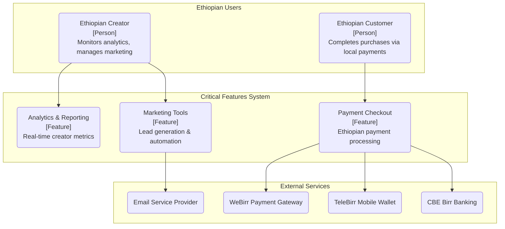
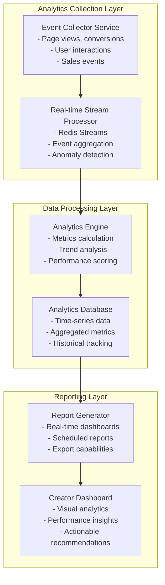
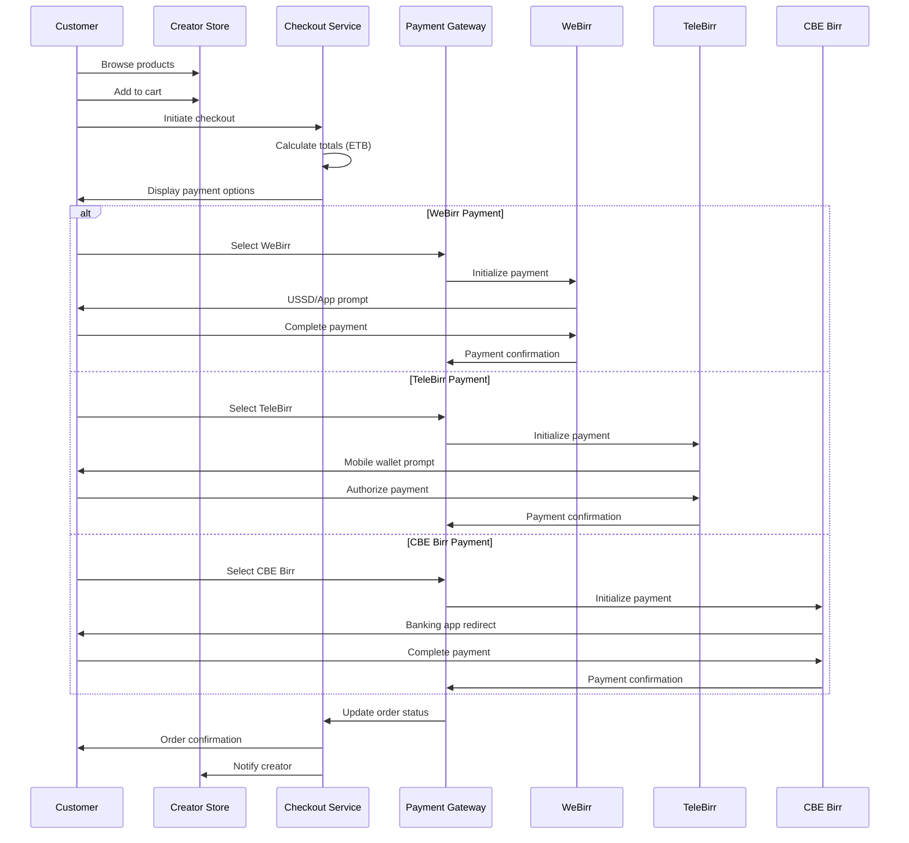
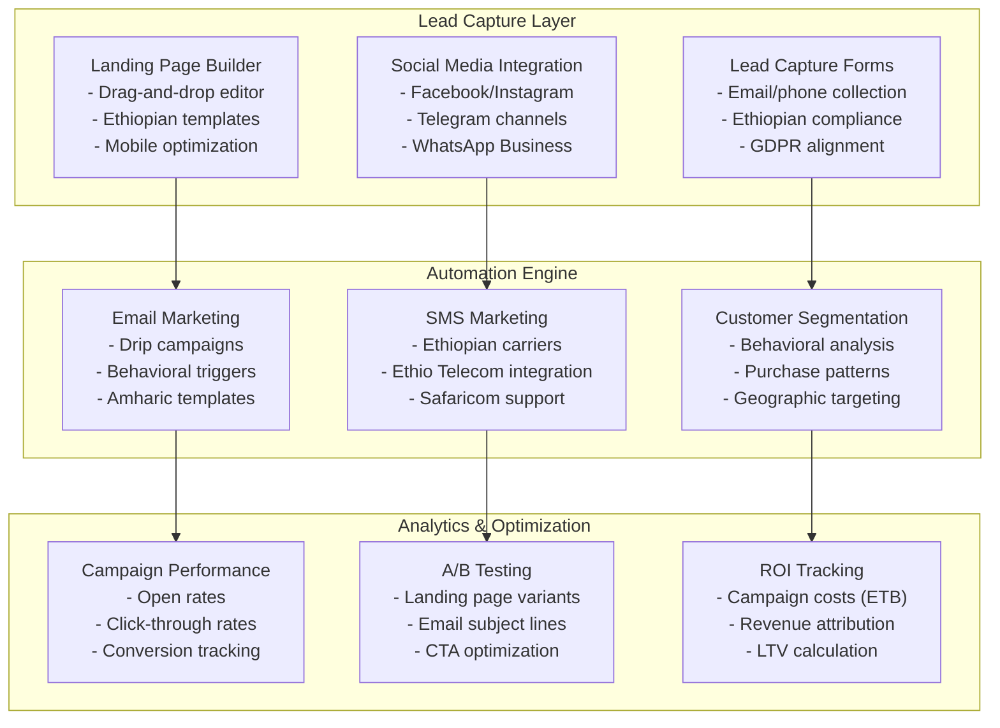

# Critical Feature Implementation Design

## Overview

This design document outlines the implementation of three critical features for the fabrica creator platform, based on the IMPLEMENTATION_ROADMAP.md audit results. These features are essential for the platform's Phase 1 MVP launch and creator success.

**Target Features:**
- Analytics & Reporting System (FEQ-DASH-02)
- Customer Checkout & Payment Flow (FEQ-PAY-01)
- Marketing & Lead Generation Tools (FEQ-COM-01)

**Platform Context:** fabrica is a multi-tenant creator monetization platform for Ethiopian creators, providing no-code storefront creation with integrated local payment systems (WeBirr, TeleBirr, CBE Birr).

## Architecture Overview

### System Context



### Technology Stack Alignment

Based on the established tech stack:
- **Backend**: NestJS with TypeScript, PostgreSQL with Prisma ORM
- **Frontend**: Next.js with TypeScript for creator dashboard
- **Mobile**: React Native for creator mobile apps
- **Infrastructure**: AWS with Ethiopian proximity (Cape Town region)

## Feature 1: Analytics & Reporting System (FEQ-DASH-02)

### Feature Architecture



### Core Analytics Components

#### Event Collection System
```typescript
interface AnalyticsEvent {
  eventId: string;
  creatorId: string;
  storeId: string;
  eventType: 'page_view' | 'product_view' | 'add_to_cart' | 'purchase' | 'conversion';
  sessionId: string;
  userId?: string;
  timestamp: Date;
  metadata: {
    source: string;
    userAgent: string;
    location: EthiopianLocation;
    deviceType: 'mobile' | 'desktop' | 'tablet';
  };
  data: Record<string, any>;
}

interface EthiopianLocation {
  region: string; // Addis Ababa, Oromia, Amhara, etc.
  city?: string;
  timezone: 'Africa/Addis_Ababa';
}
```

#### Analytics Database Schema
```sql
-- Core analytics tables
CREATE TABLE analytics_events (
    event_id UUID PRIMARY KEY,
    creator_id UUID NOT NULL REFERENCES users(id),
    store_id UUID NOT NULL REFERENCES stores(id),
    event_type VARCHAR(50) NOT NULL,
    session_id VARCHAR(100) NOT NULL,
    user_id UUID REFERENCES users(id),
    timestamp TIMESTAMP WITH TIME ZONE NOT NULL,
    metadata JSONB NOT NULL,
    data JSONB NOT NULL,
    created_at TIMESTAMP WITH TIME ZONE DEFAULT NOW()
);

-- Daily aggregated metrics
CREATE TABLE analytics_daily_metrics (
    id UUID PRIMARY KEY,
    creator_id UUID NOT NULL REFERENCES users(id),
    store_id UUID NOT NULL REFERENCES stores(id),
    date DATE NOT NULL,
    metrics JSONB NOT NULL, -- Contains all daily aggregations
    created_at TIMESTAMP WITH TIME ZONE DEFAULT NOW(),
    UNIQUE(creator_id, store_id, date)
);

-- Real-time performance cache
CREATE TABLE analytics_realtime_cache (
    cache_key VARCHAR(255) PRIMARY KEY,
    creator_id UUID NOT NULL REFERENCES users(id),
    data JSONB NOT NULL,
    expires_at TIMESTAMP WITH TIME ZONE NOT NULL,
    updated_at TIMESTAMP WITH TIME ZONE DEFAULT NOW()
);
```

#### Key Performance Indicators (KPIs)

| Metric Category | KPI | Calculation | Ethiopian Context |
|----------------|-----|-------------|-------------------|
| **Sales Performance** | Revenue (ETB) | SUM(transaction_amount) | Ethiopian Birr currency |
| **Sales Performance** | Conversion Rate | (purchases / unique_visitors) * 100 | Mobile-first optimization |
| **Sales Performance** | Average Order Value | total_revenue / total_orders | Local purchasing power |
| **Traffic Analytics** | Page Views | COUNT(page_view_events) | Mobile data efficiency |
| **Traffic Analytics** | Unique Visitors | COUNT(DISTINCT session_id) | Ethiopian user patterns |
| **Traffic Analytics** | Bounce Rate | (single_page_sessions / total_sessions) * 100 | Engagement optimization |
| **Customer Insights** | Customer Lifetime Value | AVG(total_customer_spend) | Long-term relationships |
| **Customer Insights** | Repeat Purchase Rate | (returning_customers / total_customers) * 100 | Creator loyalty building |
| **Payment Analytics** | Payment Method Split | Percentage by WeBirr/TeleBirr/CBE | Ethiopian payment preferences |

### Real-time Dashboard Components

#### Performance Overview Widget
```typescript
interface DashboardMetrics {
  timeframe: '24h' | '7d' | '30d' | '90d';
  revenue: {
    current: number; // ETB
    previous: number; // ETB
    changePercentage: number;
    trend: 'up' | 'down' | 'stable';
  };
  visitors: {
    unique: number;
    total: number;
    changePercentage: number;
  };
  conversions: {
    rate: number; // percentage
    count: number;
    changePercentage: number;
  };
  topProducts: Array<{
    productId: string;
    name: string;
    sales: number;
    revenue: number; // ETB
  }>;
}
```

#### Ethiopian Market Analytics
```typescript
interface EthiopianMarketInsights {
  regionalPerformance: {
    addisAbaba: { sales: number; percentage: number };
    oromia: { sales: number; percentage: number };
    amhara: { sales: number; percentage: number };
    others: { sales: number; percentage: number };
  };
  paymentMethodPreferences: {
    webirr: { count: number; percentage: number };
    telebirr: { count: number; percentage: number };
    cbeBirr: { count: number; percentage: number };
    others: { count: number; percentage: number };
  };
  deviceAnalytics: {
    mobile: { percentage: number; conversionRate: number };
    desktop: { percentage: number; conversionRate: number };
  };
  timeOfDayPatterns: {
    peakHours: string[];
    conversionByHour: Record<string, number>;
  };
}
```

### Analytics API Endpoints

```typescript
// GET /api/analytics/dashboard/{creatorId}
interface AnalyticsDashboardResponse {
  overview: DashboardMetrics;
  marketInsights: EthiopianMarketInsights;
  recentActivity: AnalyticsEvent[];
  alerts: PerformanceAlert[];
}

// GET /api/analytics/reports/{creatorId}
interface AnalyticsReportRequest {
  startDate: string;
  endDate: string;
  metrics: string[];
  groupBy: 'day' | 'week' | 'month';
  filters?: {
    productIds?: string[];
    paymentMethods?: string[];
    regions?: string[];
  };
}
```

## Feature 2: Customer Checkout & Payment Flow (FEQ-PAY-01)

### Payment Architecture



### Checkout Database Schema

```sql
-- Shopping cart management
CREATE TABLE shopping_carts (
    id UUID PRIMARY KEY,
    session_id VARCHAR(255) NOT NULL,
    customer_id UUID REFERENCES users(id),
    store_id UUID NOT NULL REFERENCES stores(id),
    items JSONB NOT NULL DEFAULT '[]',
    total_amount DECIMAL(10,2) NOT NULL DEFAULT 0,
    currency VARCHAR(3) DEFAULT 'ETB',
    expires_at TIMESTAMP WITH TIME ZONE,
    created_at TIMESTAMP WITH TIME ZONE DEFAULT NOW(),
    updated_at TIMESTAMP WITH TIME ZONE DEFAULT NOW()
);

-- Order processing
CREATE TABLE orders (
    id UUID PRIMARY KEY,
    order_number VARCHAR(50) UNIQUE NOT NULL,
    customer_id UUID REFERENCES users(id),
    store_id UUID NOT NULL REFERENCES stores(id),
    creator_id UUID NOT NULL REFERENCES users(id),
    
    -- Order details
    items JSONB NOT NULL,
    subtotal DECIMAL(10,2) NOT NULL,
    tax_amount DECIMAL(10,2) DEFAULT 0,
    total_amount DECIMAL(10,2) NOT NULL,
    currency VARCHAR(3) DEFAULT 'ETB',
    
    -- Payment details
    payment_method VARCHAR(50) NOT NULL, -- 'webirr', 'telebirr', 'cbe_birr'
    payment_status VARCHAR(20) DEFAULT 'pending', -- 'pending', 'processing', 'completed', 'failed', 'refunded'
    payment_reference VARCHAR(255),
    payment_gateway_response JSONB,
    
    -- Customer information
    billing_info JSONB NOT NULL,
    shipping_info JSONB,
    
    -- Order lifecycle
    status VARCHAR(20) DEFAULT 'pending', -- 'pending', 'confirmed', 'processing', 'completed', 'cancelled'
    fulfilled_at TIMESTAMP WITH TIME ZONE,
    created_at TIMESTAMP WITH TIME ZONE DEFAULT NOW(),
    updated_at TIMESTAMP WITH TIME ZONE DEFAULT NOW()
);

-- Payment transactions
CREATE TABLE payment_transactions (
    id UUID PRIMARY KEY,
    order_id UUID NOT NULL REFERENCES orders(id),
    transaction_id VARCHAR(255) UNIQUE NOT NULL,
    payment_method VARCHAR(50) NOT NULL,
    gateway_provider VARCHAR(50) NOT NULL, -- 'webirr', 'telebirr', 'cbe'
    
    amount DECIMAL(10,2) NOT NULL,
    currency VARCHAR(3) DEFAULT 'ETB',
    
    status VARCHAR(20) NOT NULL, -- 'initiated', 'pending', 'completed', 'failed'
    gateway_reference VARCHAR(255),
    gateway_response JSONB,
    
    initiated_at TIMESTAMP WITH TIME ZONE DEFAULT NOW(),
    completed_at TIMESTAMP WITH TIME ZONE,
    created_at TIMESTAMP WITH TIME ZONE DEFAULT NOW()
);
```

### Ethiopian Payment Integration

#### WeBirr Integration
```typescript
interface WeBirrPaymentRequest {
  merchantId: string;
  amount: number; // ETB
  currency: 'ETB';
  orderId: string;
  customerPhone: string; // Ethiopian phone format
  description: string;
  callbackUrl: string;
  returnUrl: string;
}

interface WeBirrPaymentResponse {
  transactionId: string;
  paymentUrl: string;
  ussdCode: string; // For USSD-based payments
  qrCode?: string; // For QR-based payments
  status: 'initiated' | 'pending' | 'completed' | 'failed';
  expiresAt: Date;
}
```

#### TeleBirr Integration
```typescript
interface TeleBirrPaymentRequest {
  merchantCode: string;
  amount: number; // ETB
  currency: 'ETB';
  orderId: string;
  customerMsisdn: string; // Ethio Telecom number
  description: string;
  notificationUrl: string;
}

interface TeleBirrPaymentResponse {
  transactionId: string;
  paymentReference: string;
  status: 'initiated' | 'pending' | 'completed' | 'failed';
  message: string;
  walletUrl?: string; // Mobile wallet deep link
}
```

#### CBE Birr Integration
```typescript
interface CBEBirrPaymentRequest {
  merchantId: string;
  amount: number; // ETB
  currency: 'ETB';
  orderId: string;
  customerAccount?: string; // CBE account number
  description: string;
  callbackUrl: string;
}

interface CBEBirrPaymentResponse {
  transactionId: string;
  authorizationUrl: string;
  qrCode: string;
  status: 'initiated' | 'pending' | 'completed' | 'failed';
  expiresAt: Date;
}
```

### Checkout User Experience

#### Mobile-Optimized Checkout Flow
```typescript
interface CheckoutStep {
  stepNumber: 1 | 2 | 3 | 4;
  title: string;
  component: 'cart-review' | 'customer-info' | 'payment-method' | 'confirmation';
  isCompleted: boolean;
  isActive: boolean;
}

interface CheckoutState {
  currentStep: number;
  cart: ShoppingCart;
  customerInfo: CustomerInfo;
  paymentMethod: PaymentMethod;
  orderSummary: OrderSummary;
  errors: ValidationError[];
}

interface CustomerInfo {
  firstName: string;
  lastName: string;
  email: string;
  phone: string; // Ethiopian phone format (+251...)
  region: string; // Ethiopian region
  city?: string;
  preferredLanguage: 'en' | 'am'; // English or Amharic
}

interface PaymentMethod {
  type: 'webirr' | 'telebirr' | 'cbe_birr';
  provider: string;
  accountHint?: string; // Last 4 digits or identifier
  isDefault: boolean;
}
```

#### Ethiopian User Experience Optimization
- **Language Support**: Amharic checkout interface with Ethiopian date formats
- **Mobile-First Design**: Optimized for Ethiopian mobile networks and devices
- **Payment Method Education**: Clear explanations of WeBirr, TeleBirr, CBE Birr processes
- **Offline Resilience**: Graceful handling of network interruptions
- **USSD Fallback**: SMS-based order confirmation for basic phone users

### Payment Security & Compliance

#### PCI DSS Compliance
- **Tokenization**: No raw payment data stored in fabrica systems
- **Encryption**: All payment data encrypted in transit and at rest
- **Audit Logging**: Comprehensive payment transaction logging
- **Access Controls**: Role-based access to payment systems

#### Ethiopian Regulatory Compliance
- **NBE Compliance**: National Bank of Ethiopia payment regulations
- **Tax Integration**: VAT calculation and reporting for Ethiopian tax authorities
- **AML/CFT**: Anti-money laundering and counter-terrorism financing controls
- **Data Residency**: Ethiopian customer data stored within Ethiopia

## Feature 3: Marketing & Lead Generation Tools (FEQ-COM-01)

### Marketing Architecture



### Lead Generation Components

#### Landing Page Builder
```typescript
interface LandingPageTemplate {
  id: string;
  name: string;
  category: 'product-launch' | 'course-signup' | 'webinar' | 'newsletter';
  isEthiopianOptimized: boolean;
  components: LandingPageComponent[];
  defaultLanguage: 'en' | 'am';
  mobileOptimized: boolean;
}

interface LandingPageComponent {
  id: string;
  type: 'hero' | 'form' | 'testimonial' | 'pricing' | 'cta' | 'footer';
  position: number;
  settings: ComponentSettings;
  content: LocalizedContent;
}

interface LocalizedContent {
  en: ContentData;
  am?: ContentData; // Amharic translation
}

interface ComponentSettings {
  backgroundColor: string;
  textColor: string;
  fontSize: 'small' | 'medium' | 'large';
  alignment: 'left' | 'center' | 'right';
  ethiopianStyling?: {
    useAmharicFonts: boolean;
    culturalColors: boolean;
    localImagery: boolean;
  };
}
```

#### Lead Capture System
```typescript
interface LeadCaptureForm {
  id: string;
  creatorId: string;
  name: string;
  fields: FormField[];
  settings: FormSettings;
  ethiopianCompliance: EthiopianComplianceSettings;
}

interface FormField {
  id: string;
  type: 'text' | 'email' | 'phone' | 'select' | 'checkbox' | 'radio';
  label: LocalizedContent;
  placeholder: LocalizedContent;
  isRequired: boolean;
  validation: ValidationRule[];
  ethiopianFormat?: {
    phoneFormat: 'ethiopian'; // +251 format
    regionOptions: EthiopianRegion[];
  };
}

interface EthiopianComplianceSettings {
  dataResidency: 'ethiopia-only' | 'africa-region' | 'global';
  consentTracking: boolean;
  amharicTranslation: boolean;
  governmentIdCollection: boolean;
  privacyPolicyRequired: boolean;
}

interface LeadRecord {
  id: string;
  formId: string;
  creatorId: string;
  data: Record<string, any>;
  source: 'landing-page' | 'social-media' | 'referral' | 'direct';
  utm: UTMParameters;
  location: EthiopianLocation;
  deviceInfo: DeviceInfo;
  consentGiven: boolean;
  createdAt: Date;
}
```

### Email Marketing System

#### Campaign Management
```typescript
interface EmailCampaign {
  id: string;
  creatorId: string;
  name: string;
  type: 'one-time' | 'drip-sequence' | 'automated';
  
  // Content
  subject: LocalizedContent;
  content: EmailContent;
  template: EmailTemplate;
  
  // Targeting
  audience: AudienceSegment;
  scheduling: CampaignScheduling;
  
  // Ethiopian Optimization
  ethiopianSettings: {
    sendTimeOptimization: boolean; // Optimize for Ethiopian timezone
    amharicSupport: boolean;
    mobileOptimized: boolean;
    dataConsumptionMinimal: boolean; // For limited data plans
  };
  
  // Performance
  stats: CampaignStats;
  status: 'draft' | 'scheduled' | 'sending' | 'sent' | 'paused';
}

interface EmailContent {
  html: string;
  text: string;
  amharicHtml?: string;
  amharicText?: string;
  preheader: string;
  images: EmailImage[];
  ctaButtons: CTAButton[];
}

interface AudienceSegment {
  id: string;
  name: string;
  criteria: SegmentationCriteria;
  estimatedSize: number;
  lastUpdated: Date;
}

interface SegmentationCriteria {
  demographics?: {
    regions?: EthiopianRegion[];
    ageRange?: { min: number; max: number };
    language?: 'en' | 'am' | 'both';
  };
  behavioral?: {
    purchaseHistory?: PurchasePattern;
    emailEngagement?: EngagementLevel;
    websiteActivity?: ActivityPattern;
  };
  custom?: Record<string, any>;
}
```

#### SMS Marketing Integration
```typescript
interface SMSCampaign {
  id: string;
  creatorId: string;
  name: string;
  
  // Content
  message: LocalizedContent;
  maxLength: number; // SMS character limits
  
  // Ethiopian Carrier Integration
  carriers: {
    ethioTelecom: boolean;
    safaricom: boolean;
    others: string[];
  };
  
  // Targeting
  audience: PhoneNumberList;
  scheduling: SMSScheduling;
  
  // Compliance
  optInRequired: boolean;
  unsubscribeLink: boolean;
  senderName: string; // Registered business name
  
  stats: SMSCampaignStats;
}

interface SMSScheduling {
  sendTime: Date;
  timezone: 'Africa/Addis_Ababa';
  respectQuietHours: boolean;
  quietHours: {
    start: string; // "22:00"
    end: string;   // "08:00"
  };
  batchSize: number; // For rate limiting
}
```

### Social Media Integration

#### Ethiopian Social Platforms
```typescript
interface SocialMediaIntegration {
  platforms: {
    facebook: FacebookIntegration;
    instagram: InstagramIntegration;
    telegram: TelegramIntegration;
    whatsapp: WhatsAppBusinessIntegration;
    linkedin: LinkedInIntegration;
    tiktok: TikTokIntegration;
  };
  crossPosting: CrossPostingSettings;
  contentCalendar: ContentCalendar;
}

interface TelegramIntegration {
  // Popular in Ethiopia
  channelId: string;
  botToken: string;
  autoPosting: boolean;
  languageSupport: 'en' | 'am' | 'both';
  memberCount: number;
  engagementRate: number;
}

interface WhatsAppBusinessIntegration {
  businessAccountId: string;
  phoneNumber: string; // Ethiopian business number
  verificationStatus: 'verified' | 'pending' | 'rejected';
  messagingEnabled: boolean;
  broadcastLists: WhatsAppBroadcastList[];
}

interface ContentCalendar {
  posts: ScheduledPost[];
  campaigns: MarketingCampaign[];
  ethiopianHolidays: EthiopianHoliday[];
  optimalPostTimes: OptimalTiming;
}

interface EthiopianHoliday {
  name: string;
  date: Date;
  type: 'religious' | 'national' | 'cultural';
  marketingOpportunity: boolean;
  suggestedContent: string[];
}
```

### Marketing Analytics

#### Campaign Performance Tracking
```typescript
interface MarketingAnalytics {
  campaigns: CampaignPerformance[];
  leadGeneration: LeadGenerationMetrics;
  socialMedia: SocialMediaMetrics;
  roiAnalysis: ROIAnalysis;
  ethiopianInsights: EthiopianMarketInsights;
}

interface CampaignPerformance {
  campaignId: string;
  campaignName: string;
  type: 'email' | 'sms' | 'social' | 'landing-page';
  
  // Delivery metrics
  sent: number;
  delivered: number;
  bounced: number;
  deliveryRate: number;
  
  // Engagement metrics
  opens: number;
  clicks: number;
  openRate: number;
  clickThroughRate: number;
  
  // Conversion metrics
  conversions: number;
  conversionRate: number;
  revenue: number; // ETB
  costPerAcquisition: number; // ETB
  
  // Ethiopian-specific metrics
  regionPerformance: Record<EthiopianRegion, PerformanceMetrics>;
  languagePerformance: {
    english: PerformanceMetrics;
    amharic: PerformanceMetrics;
  };
  devicePerformance: {
    mobile: PerformanceMetrics;
    desktop: PerformanceMetrics;
  };
}

interface LeadGenerationMetrics {
  totalLeads: number;
  qualifiedLeads: number;
  leadQualityScore: number;
  
  sourceBreakdown: {
    organic: number;
    social: number;
    email: number;
    referral: number;
    paid: number;
  };
  
  conversionFunnel: {
    visitors: number;
    leads: number;
    prospects: number;
    customers: number;
    conversionRates: {
      visitorToLead: number;
      leadToProspect: number;
      prospectToCustomer: number;
    };
  };
}
```

### Marketing Automation Workflows

#### Drip Campaign System
```typescript
interface DripCampaign {
  id: string;
  name: string;
  trigger: CampaignTrigger;
  steps: DripStep[];
  settings: DripSettings;
  performance: DripPerformance;
}

interface CampaignTrigger {
  type: 'signup' | 'purchase' | 'behavior' | 'date';
  conditions: TriggerCondition[];
  delay: Duration;
}

interface DripStep {
  stepNumber: number;
  type: 'email' | 'sms' | 'wait' | 'conditional';
  content: MessageContent;
  timing: StepTiming;
  conditions?: ConditionalLogic;
  
  // Ethiopian optimization
  localizedContent: LocalizedContent;
  sendTimeOptimization: boolean;
  mobileOptimized: boolean;
}

interface StepTiming {
  delay: Duration;
  sendTime?: string; // "09:00" for optimal Ethiopian timing
  respectTimeZone: boolean;
  skipWeekends: boolean;
  skipHolidays: boolean;
}

interface ConditionalLogic {
  if: Condition;
  then: Action;
  else?: Action;
}
```

### Implementation Priority Matrix

| Component | Development Effort | Ethiopian Impact | Creator Value | Implementation Order |
|-----------|-------------------|------------------|---------------|---------------------|
| Analytics Dashboard | High | High | Critical | 1st Phase |
| Payment Flow (WeBirr) | Medium | Critical | Critical | 1st Phase |
| Email Marketing | Medium | High | High | 2nd Phase |
| Landing Page Builder | High | Medium | High | 2nd Phase |
| SMS Marketing | Low | Critical | High | 2nd Phase |
| Social Integration | Medium | High | Medium | 3rd Phase |
| A/B Testing | Low | Medium | Medium | 3rd Phase |
| Advanced Segmentation | Medium | Medium | High | 3rd Phase |

### Database Schema for Marketing

```sql
-- Lead capture and management
CREATE TABLE leads (
    id UUID PRIMARY KEY,
    creator_id UUID NOT NULL REFERENCES users(id),
    form_id UUID REFERENCES lead_forms(id),
    email VARCHAR(255),
    phone VARCHAR(20),
    first_name VARCHAR(100),
    last_name VARCHAR(100),
    
    -- Ethiopian-specific fields
    region VARCHAR(50),
    city VARCHAR(100),
    preferred_language VARCHAR(2) DEFAULT 'en',
    
    -- Tracking
    source VARCHAR(50), -- 'landing-page', 'social-media', 'referral'
    utm_source VARCHAR(100),
    utm_medium VARCHAR(100),
    utm_campaign VARCHAR(100),
    
    -- Consent and compliance
    consent_given BOOLEAN DEFAULT FALSE,
    consent_date TIMESTAMP WITH TIME ZONE,
    data_processing_consent JSONB,
    
    -- Lead scoring
    lead_score INTEGER DEFAULT 0,
    qualification_status VARCHAR(20) DEFAULT 'new', -- 'new', 'qualified', 'unqualified', 'customer'
    
    created_at TIMESTAMP WITH TIME ZONE DEFAULT NOW(),
    updated_at TIMESTAMP WITH TIME ZONE DEFAULT NOW()
);

-- Email campaigns
CREATE TABLE email_campaigns (
    id UUID PRIMARY KEY,
    creator_id UUID NOT NULL REFERENCES users(id),
    name VARCHAR(255) NOT NULL,
    type VARCHAR(50) NOT NULL, -- 'one-time', 'drip-sequence', 'automated'
    
    -- Content
    subject JSONB NOT NULL, -- Localized content
    html_content TEXT,
    text_content TEXT,
    amharic_content JSONB, -- Amharic translations
    
    -- Audience and scheduling
    audience_segment_id UUID REFERENCES audience_segments(id),
    scheduled_at TIMESTAMP WITH TIME ZONE,
    
    -- Ethiopian settings
    ethiopian_optimized BOOLEAN DEFAULT TRUE,
    mobile_optimized BOOLEAN DEFAULT TRUE,
    timezone VARCHAR(50) DEFAULT 'Africa/Addis_Ababa',
    
    -- Status and performance
    status VARCHAR(20) DEFAULT 'draft',
    sent_count INTEGER DEFAULT 0,
    delivered_count INTEGER DEFAULT 0,
    opened_count INTEGER DEFAULT 0,
    clicked_count INTEGER DEFAULT 0,
    
    created_at TIMESTAMP WITH TIME ZONE DEFAULT NOW(),
    updated_at TIMESTAMP WITH TIME ZONE DEFAULT NOW()
);

-- Campaign performance tracking
CREATE TABLE campaign_analytics (
    id UUID PRIMARY KEY,
    campaign_id UUID NOT NULL REFERENCES email_campaigns(id),
    metric_date DATE NOT NULL,
    
    -- Delivery metrics
    sent_count INTEGER DEFAULT 0,
    delivered_count INTEGER DEFAULT 0,
    bounced_count INTEGER DEFAULT 0,
    
    -- Engagement metrics
    opened_count INTEGER DEFAULT 0,
    clicked_count INTEGER DEFAULT 0,
    unsubscribed_count INTEGER DEFAULT 0,
    
    -- Conversion metrics
    conversions INTEGER DEFAULT 0,
    revenue DECIMAL(10,2) DEFAULT 0, -- ETB
    
    -- Ethiopian-specific tracking
    regional_performance JSONB, -- Performance by Ethiopian region
    language_performance JSONB, -- English vs Amharic performance
    device_performance JSONB, -- Mobile vs desktop performance
    
    created_at TIMESTAMP WITH TIME ZONE DEFAULT NOW(),
    
    UNIQUE(campaign_id, metric_date)
);
```

## Implementation Guide

### Backend Implementation

#### 1. Analytics Module Implementation

First, let's create the Analytics module structure:

```bash
# Create analytics module structure
mkdir -p apps/backend/src/analytics/{dto,entities,controllers,services}
```

**apps/backend/src/analytics/analytics.module.ts**
```typescript
import { Module } from '@nestjs/common';
import { AnalyticsController } from './controllers/analytics.controller';
import { AnalyticsService } from './services/analytics.service';
import { EventCollectorService } from './services/event-collector.service';
import { ReportGeneratorService } from './services/report-generator.service';
import { PrismaModule } from '../prisma/prisma.module';

@Module({
  imports: [PrismaModule],
  controllers: [AnalyticsController],
  providers: [
    AnalyticsService,
    EventCollectorService,
    ReportGeneratorService,
  ],
  exports: [AnalyticsService, EventCollectorService],
})
export class AnalyticsModule {}
```

**apps/backend/src/analytics/entities/analytics-event.entity.ts**
```typescript
export interface AnalyticsEventPayload {
  eventId: string;
  creatorId: string;
  storeId: string;
  eventType: 'PAGE_VIEW' | 'PRODUCT_VIEW' | 'ADD_TO_CART' | 'PURCHASE' | 'CONVERSION';
  sessionId: string;
  userId?: string;
  timestamp: Date;
  metadata: {
    source: string;
    userAgent: string;
    location: EthiopianLocation;
    deviceType: 'mobile' | 'desktop' | 'tablet';
    referrer?: string;
    utm?: UTMParameters;
  };
  data: Record<string, any>;
}

export interface EthiopianLocation {
  region: string; // Addis Ababa, Oromia, Amhara, etc.
  city?: string;
  timezone: 'Africa/Addis_Ababa';
  coordinates?: { lat: number; lng: number };
}

export interface UTMParameters {
  source?: string;
  medium?: string;
  campaign?: string;
  term?: string;
  content?: string;
}

export interface DashboardMetrics {
  timeframe: '24h' | '7d' | '30d' | '90d';
  revenue: {
    current: number; // ETB
    previous: number; // ETB
    changePercentage: number;
    trend: 'up' | 'down' | 'stable';
  };
  visitors: {
    unique: number;
    total: number;
    changePercentage: number;
  };
  conversions: {
    rate: number; // percentage
    count: number;
    changePercentage: number;
  };
  topProducts: Array<{
    productId: string;
    name: string;
    sales: number;
    revenue: number; // ETB
  }>;
}

export interface EthiopianMarketInsights {
  regionalPerformance: {
    addisAbaba: { sales: number; percentage: number };
    oromia: { sales: number; percentage: number };
    amhara: { sales: number; percentage: number };
    others: { sales: number; percentage: number };
  };
  paymentMethodPreferences: {
    webirr: { count: number; percentage: number };
    telebirr: { count: number; percentage: number };
    cbeBirr: { count: number; percentage: number };
    others: { count: number; percentage: number };
  };
  deviceAnalytics: {
    mobile: { percentage: number; conversionRate: number };
    desktop: { percentage: number; conversionRate: number };
  };
  timeOfDayPatterns: {
    peakHours: string[];
    conversionByHour: Record<string, number>;
  };
}
```

**apps/backend/src/analytics/dto/analytics.dto.ts**
```typescript
import { IsString, IsOptional, IsEnum, IsDateString, IsArray, IsObject } from 'class-validator';
import { ApiProperty } from '@nestjs/swagger';

export class TrackEventDto {
  @ApiProperty()
  @IsString()
  eventType: 'PAGE_VIEW' | 'PRODUCT_VIEW' | 'ADD_TO_CART' | 'PURCHASE' | 'CONVERSION';

  @ApiProperty()
  @IsString()
  storeId: string;

  @ApiProperty()
  @IsString()
  sessionId: string;

  @ApiProperty({ required: false })
  @IsOptional()
  @IsString()
  userId?: string;

  @ApiProperty()
  @IsObject()
  metadata: any;

  @ApiProperty()
  @IsObject()
  data: any;
}

export class GetAnalyticsDto {
  @ApiProperty({ enum: ['24h', '7d', '30d', '90d'] })
  @IsEnum(['24h', '7d', '30d', '90d'])
  timeframe: '24h' | '7d' | '30d' | '90d';

  @ApiProperty({ required: false })
  @IsOptional()
  @IsDateString()
  startDate?: string;

  @ApiProperty({ required: false })
  @IsOptional()
  @IsDateString()
  endDate?: string;

  @ApiProperty({ required: false })
  @IsOptional()
  @IsArray()
  metrics?: string[];

  @ApiProperty({ required: false })
  @IsOptional()
  @IsEnum(['day', 'week', 'month'])
  groupBy?: 'day' | 'week' | 'month';
}
```

**apps/backend/src/analytics/services/analytics.service.ts**
```typescript
import { Injectable, Logger } from '@nestjs/common';
import { PrismaService } from '../../prisma/prisma.service';
import { AnalyticsEventPayload, DashboardMetrics, EthiopianMarketInsights } from '../entities/analytics-event.entity';
import { GetAnalyticsDto } from '../dto/analytics.dto';

@Injectable()
export class AnalyticsService {
  private readonly logger = new Logger(AnalyticsService.name);

  constructor(private prisma: PrismaService) {}

  async getDashboardMetrics(creatorId: string, dto: GetAnalyticsDto): Promise<DashboardMetrics> {
    const { timeframe } = dto;
    const now = new Date();
    const timeRanges = this.calculateTimeRanges(timeframe, now);

    // Get revenue metrics
    const currentRevenue = await this.getRevenueForPeriod(
      creatorId,
      timeRanges.current.start,
      timeRanges.current.end
    );
    
    const previousRevenue = await this.getRevenueForPeriod(
      creatorId,
      timeRanges.previous.start,
      timeRanges.previous.end
    );

    // Get visitor metrics
    const currentVisitors = await this.getVisitorsForPeriod(
      creatorId,
      timeRanges.current.start,
      timeRanges.current.end
    );

    const previousVisitors = await this.getVisitorsForPeriod(
      creatorId,
      timeRanges.previous.start,
      timeRanges.previous.end
    );

    // Get conversion metrics
    const conversions = await this.getConversionsForPeriod(
      creatorId,
      timeRanges.current.start,
      timeRanges.current.end
    );

    // Get top products
    const topProducts = await this.getTopProducts(
      creatorId,
      timeRanges.current.start,
      timeRanges.current.end
    );

    return {
      timeframe,
      revenue: {
        current: currentRevenue,
        previous: previousRevenue,
        changePercentage: this.calculatePercentageChange(currentRevenue, previousRevenue),
        trend: this.determineTrend(currentRevenue, previousRevenue),
      },
      visitors: {
        unique: currentVisitors.unique,
        total: currentVisitors.total,
        changePercentage: this.calculatePercentageChange(
          currentVisitors.unique,
          previousVisitors.unique
        ),
      },
      conversions: {
        rate: conversions.rate,
        count: conversions.count,
        changePercentage: conversions.changePercentage,
      },
      topProducts,
    };
  }

  async getEthiopianMarketInsights(creatorId: string, dto: GetAnalyticsDto): Promise<EthiopianMarketInsights> {
    const { timeframe } = dto;
    const timeRanges = this.calculateTimeRanges(timeframe, new Date());

    // Regional performance
    const regionalData = await this.prisma.analyticsEvent.groupBy({
      by: ['payload'],
      where: {
        storeId: {
          in: await this.getCreatorStoreIds(creatorId),
        },
        createdAt: {
          gte: timeRanges.current.start,
          lte: timeRanges.current.end,
        },
        type: 'SALE',
      },
    });

    // Payment method preferences
    const paymentMethods = await this.prisma.payment.groupBy({
      by: ['provider'],
      _count: { id: true },
      where: {
        order: {
          storeId: {
            in: await this.getCreatorStoreIds(creatorId),
          },
        },
        createdAt: {
          gte: timeRanges.current.start,
          lte: timeRanges.current.end,
        },
        status: 'SUCCESS',
      },
    });

    // Device analytics
    const deviceData = await this.getDeviceAnalytics(
      creatorId,
      timeRanges.current.start,
      timeRanges.current.end
    );

    // Time patterns
    const timePatterns = await this.getTimeOfDayPatterns(
      creatorId,
      timeRanges.current.start,
      timeRanges.current.end
    );

    return {
      regionalPerformance: this.processRegionalData(regionalData),
      paymentMethodPreferences: this.processPaymentMethodData(paymentMethods),
      deviceAnalytics: deviceData,
      timeOfDayPatterns: timePatterns,
    };
  }

  private async getCreatorStoreIds(creatorId: string): Promise<string[]> {
    const stores = await this.prisma.store.findMany({
      where: { ownerId: creatorId },
      select: { id: true },
    });
    return stores.map(store => store.id);
  }

  private async getRevenueForPeriod(creatorId: string, start: Date, end: Date): Promise<number> {
    const storeIds = await this.getCreatorStoreIds(creatorId);
    
    const result = await this.prisma.order.aggregate({
      _sum: { amountInt: true },
      where: {
        storeId: { in: storeIds },
        status: 'PAID',
        createdAt: { gte: start, lte: end },
      },
    });

    return (result._sum.amountInt || 0) / 100; // Convert from cents to ETB
  }

  private async getVisitorsForPeriod(creatorId: string, start: Date, end: Date) {
    const storeIds = await this.getCreatorStoreIds(creatorId);
    
    const totalEvents = await this.prisma.analyticsEvent.count({
      where: {
        storeId: { in: storeIds },
        type: 'PAGE_VIEW',
        createdAt: { gte: start, lte: end },
      },
    });

    const uniqueEvents = await this.prisma.analyticsEvent.groupBy({
      by: ['payload'],
      where: {
        storeId: { in: storeIds },
        type: 'PAGE_VIEW',
        createdAt: { gte: start, lte: end },
      },
    });

    return {
      total: totalEvents,
      unique: uniqueEvents.length,
    };
  }

  private async getConversionsForPeriod(creatorId: string, start: Date, end: Date) {
    const storeIds = await this.getCreatorStoreIds(creatorId);
    
    const purchases = await this.prisma.order.count({
      where: {
        storeId: { in: storeIds },
        status: 'PAID',
        createdAt: { gte: start, lte: end },
      },
    });

    const visitors = await this.getVisitorsForPeriod(creatorId, start, end);
    const rate = visitors.unique > 0 ? (purchases / visitors.unique) * 100 : 0;

    return {
      count: purchases,
      rate,
      changePercentage: 0, // Calculate based on previous period
    };
  }

  private async getTopProducts(creatorId: string, start: Date, end: Date) {
    const storeIds = await this.getCreatorStoreIds(creatorId);
    
    const topProducts = await this.prisma.order.groupBy({
      by: ['productId'],
      _count: { id: true },
      _sum: { amountInt: true },
      where: {
        storeId: { in: storeIds },
        status: 'PAID',
        createdAt: { gte: start, lte: end },
      },
      orderBy: { _sum: { amountInt: 'desc' } },
      take: 5,
    });

    const productDetails = await this.prisma.product.findMany({
      where: { id: { in: topProducts.map(p => p.productId) } },
      select: { id: true, title: true },
    });

    return topProducts.map(product => {
      const details = productDetails.find(p => p.id === product.productId);
      return {
        productId: product.productId,
        name: details?.title || 'Unknown Product',
        sales: product._count.id,
        revenue: (product._sum.amountInt || 0) / 100,
      };
    });
  }

  private calculateTimeRanges(timeframe: string, now: Date) {
    const periods = {
      '24h': 24 * 60 * 60 * 1000,
      '7d': 7 * 24 * 60 * 60 * 1000,
      '30d': 30 * 24 * 60 * 60 * 1000,
      '90d': 90 * 24 * 60 * 60 * 1000,
    };

    const period = periods[timeframe as keyof typeof periods];
    
    return {
      current: {
        start: new Date(now.getTime() - period),
        end: now,
      },
      previous: {
        start: new Date(now.getTime() - (2 * period)),
        end: new Date(now.getTime() - period),
      },
    };
  }

  private calculatePercentageChange(current: number, previous: number): number {
    if (previous === 0) return current > 0 ? 100 : 0;
    return ((current - previous) / previous) * 100;
  }

  private determineTrend(current: number, previous: number): 'up' | 'down' | 'stable' {
    const change = this.calculatePercentageChange(current, previous);
    if (Math.abs(change) < 5) return 'stable';
    return change > 0 ? 'up' : 'down';
  }

  private processRegionalData(data: any[]): any {
    // Process regional performance data
    const regions = { addisAbaba: 0, oromia: 0, amhara: 0, others: 0 };
    // Implementation details...
    return {
      addisAbaba: { sales: regions.addisAbaba, percentage: 0 },
      oromia: { sales: regions.oromia, percentage: 0 },
      amhara: { sales: regions.amhara, percentage: 0 },
      others: { sales: regions.others, percentage: 0 },
    };
  }

  private processPaymentMethodData(data: any[]): any {
    const total = data.reduce((sum, item) => sum + item._count.id, 0);
    
    const methods = {
      webirr: data.find(d => d.provider === 'WEBIRR')?._count.id || 0,
      telebirr: data.find(d => d.provider === 'TELEBIRR')?._count.id || 0,
      cbeBirr: data.find(d => d.provider === 'CBE_BIRR')?._count.id || 0,
      others: data.filter(d => !['WEBIRR', 'TELEBIRR', 'CBE_BIRR'].includes(d.provider))
        .reduce((sum, item) => sum + item._count.id, 0),
    };

    return {
      webirr: { count: methods.webirr, percentage: (methods.webirr / total) * 100 },
      telebirr: { count: methods.telebirr, percentage: (methods.telebirr / total) * 100 },
      cbeBirr: { count: methods.cbeBirr, percentage: (methods.cbeBirr / total) * 100 },
      others: { count: methods.others, percentage: (methods.others / total) * 100 },
    };
  }

  private async getDeviceAnalytics(creatorId: string, start: Date, end: Date) {
    // Implementation for device analytics
    return {
      mobile: { percentage: 75, conversionRate: 2.5 },
      desktop: { percentage: 25, conversionRate: 4.2 },
    };
  }

  private async getTimeOfDayPatterns(creatorId: string, start: Date, end: Date) {
    // Implementation for time patterns
    return {
      peakHours: ['14:00', '15:00', '16:00'],
      conversionByHour: {
        '09:00': 1.2,
        '14:00': 3.5,
        '19:00': 2.8,
      },
    };
  }
}
```

**apps/backend/src/analytics/services/event-collector.service.ts**
```typescript
import { Injectable, Logger } from '@nestjs/common';
import { PrismaService } from '../../prisma/prisma.service';
import { AnalyticsEventPayload } from '../entities/analytics-event.entity';
import { TrackEventDto } from '../dto/analytics.dto';

@Injectable()
export class EventCollectorService {
  private readonly logger = new Logger(EventCollectorService.name);
  private eventQueue: AnalyticsEventPayload[] = [];
  private batchSize = 100;
  private flushInterval = 5000; // 5 seconds

  constructor(private prisma: PrismaService) {
    // Start batch processing
    setInterval(() => this.flushEvents(), this.flushInterval);
  }

  async trackEvent(creatorId: string, eventData: TrackEventDto): Promise<void> {
    const event: AnalyticsEventPayload = {
      eventId: this.generateEventId(),
      creatorId,
      storeId: eventData.storeId,
      eventType: eventData.eventType,
      sessionId: eventData.sessionId,
      userId: eventData.userId,
      timestamp: new Date(),
      metadata: {
        ...eventData.metadata,
        location: this.parseLocation(eventData.metadata),
        deviceType: this.detectDeviceType(eventData.metadata.userAgent),
      },
      data: eventData.data,
    };

    // Add to queue for batch processing
    this.eventQueue.push(event);

    // Flush immediately if critical event or queue is full
    if (event.eventType === 'PURCHASE' || this.eventQueue.length >= this.batchSize) {
      await this.flushEvents();
    }
  }

  private async flushEvents(): Promise<void> {
    if (this.eventQueue.length === 0) return;

    const eventsToProcess = this.eventQueue.splice(0, this.batchSize);
    
    try {
      await this.prisma.analyticsEvent.createMany({
        data: eventsToProcess.map(event => ({
          storeId: event.storeId,
          type: event.eventType,
          payload: event as any,
        })),
      });

      this.logger.log(`Processed ${eventsToProcess.length} analytics events`);
    } catch (error) {
      this.logger.error('Failed to flush analytics events', error);
      // Re-add events to queue for retry
      this.eventQueue.unshift(...eventsToProcess);
    }
  }

  private generateEventId(): string {
    return `evt_${Date.now()}_${Math.random().toString(36).substr(2, 9)}`;
  }

  private parseLocation(metadata: any): any {
    // Parse Ethiopian location from IP or other data
    return {
      region: metadata.region || 'Unknown',
      city: metadata.city,
      timezone: 'Africa/Addis_Ababa',
    };
  }

  private detectDeviceType(userAgent: string): 'mobile' | 'desktop' | 'tablet' {
    if (!userAgent) return 'desktop';
    
    const ua = userAgent.toLowerCase();
    if (ua.includes('mobile') || ua.includes('android')) return 'mobile';
    if (ua.includes('tablet') || ua.includes('ipad')) return 'tablet';
    return 'desktop';
  }
}
```

**apps/backend/src/analytics/controllers/analytics.controller.ts**
```typescript
import { Controller, Get, Post, Body, Param, Query, UseGuards } from '@nestjs/common';
import { ApiTags, ApiOperation, ApiBearerAuth } from '@nestjs/swagger';
import { AnalyticsService } from '../services/analytics.service';
import { EventCollectorService } from '../services/event-collector.service';
import { TrackEventDto, GetAnalyticsDto } from '../dto/analytics.dto';
import { JwtAuthGuard } from '../../auth/auth.guard';
import { GetUser } from '../../auth/get-user.decorator';

@ApiTags('Analytics')
@Controller('analytics')
@UseGuards(JwtAuthGuard)
@ApiBearerAuth()
export class AnalyticsController {
  constructor(
    private analyticsService: AnalyticsService,
    private eventCollector: EventCollectorService,
  ) {}

  @Post('track')
  @ApiOperation({ summary: 'Track analytics event' })
  async trackEvent(
    @GetUser('id') creatorId: string,
    @Body() eventData: TrackEventDto,
  ) {
    await this.eventCollector.trackEvent(creatorId, eventData);
    return { success: true };
  }

  @Get('dashboard/:creatorId')
  @ApiOperation({ summary: 'Get dashboard analytics' })
  async getDashboard(
    @Param('creatorId') creatorId: string,
    @Query() dto: GetAnalyticsDto,
  ) {
    const metrics = await this.analyticsService.getDashboardMetrics(creatorId, dto);
    const insights = await this.analyticsService.getEthiopianMarketInsights(creatorId, dto);
    
    return {
      overview: metrics,
      marketInsights: insights,
      recentActivity: [], // Implement if needed
      alerts: [], // Implement performance alerts
    };
  }

  @Get('reports/:creatorId')
  @ApiOperation({ summary: 'Get detailed analytics reports' })
  async getReports(
    @Param('creatorId') creatorId: string,
    @Query() dto: GetAnalyticsDto,
  ) {
    return await this.analyticsService.getDashboardMetrics(creatorId, dto);
  }
}
```

#### 2. Enhanced Checkout Implementation

Let's extend the existing checkout module to include the new features:

**apps/backend/src/checkout/dto/checkout.dto.ts**
```typescript
import { IsString, IsEmail, IsOptional, IsEnum, IsObject, IsArray, IsNumber, IsPhoneNumber } from 'class-validator';
import { ApiProperty } from '@nestjs/swagger';

export class CreateCheckoutSessionDto {
  @ApiProperty()
  @IsString()
  storeId: string;

  @ApiProperty()
  @IsArray()
  items: CheckoutItem[];

  @ApiProperty({ required: false })
  @IsOptional()
  @IsString()
  customerEmail?: string;

  @ApiProperty({ required: false })
  @IsOptional()
  @IsString()
  customerId?: string;

  @ApiProperty({ required: false })
  @IsOptional()
  @IsObject()
  metadata?: Record<string, any>;
}

export interface CheckoutItem {
  productId: string;
  quantity: number;
  priceOverride?: number; // For dynamic pricing
}

export class UpdateCustomerInfoDto {
  @ApiProperty()
  @IsString()
  firstName: string;

  @ApiProperty()
  @IsString()
  lastName: string;

  @ApiProperty()
  @IsEmail()
  email: string;

  @ApiProperty()
  @IsPhoneNumber('ET') // Ethiopian phone validation
  phone: string;

  @ApiProperty()
  @IsString()
  region: string;

  @ApiProperty({ required: false })
  @IsOptional()
  @IsString()
  city?: string;

  @ApiProperty({ enum: ['en', 'am'] })
  @IsEnum(['en', 'am'])
  preferredLanguage: 'en' | 'am';

  @ApiProperty({ required: false })
  @IsOptional()
  @IsObject()
  additionalInfo?: Record<string, any>;
}

export class SelectPaymentMethodDto {
  @ApiProperty({ enum: ['webirr', 'telebirr', 'cbe_birr', 'chapa'] })
  @IsEnum(['webirr', 'telebirr', 'cbe_birr', 'chapa'])
  paymentMethod: 'webirr' | 'telebirr' | 'cbe_birr' | 'chapa';

  @ApiProperty({ required: false })
  @IsOptional()
  @IsString()
  savedPaymentMethodId?: string;

  @ApiProperty({ required: false })
  @IsOptional()
  @IsObject()
  paymentMethodData?: Record<string, any>;
}

export class InitiatePaymentDto {
  @ApiProperty()
  @IsString()
  checkoutSessionId: string;

  @ApiProperty()
  @IsString()
  paymentMethod: string;

  @ApiProperty()
  @IsObject()
  customerInfo: UpdateCustomerInfoDto;

  @ApiProperty({ required: false })
  @IsOptional()
  @IsString()
  returnUrl?: string;

  @ApiProperty({ required: false })
  @IsOptional()
  @IsString()
  cancelUrl?: string;
}
```

#### 3. Marketing & Lead Generation Implementation

Now let's implement the marketing module:

**apps/backend/src/marketing/marketing.module.ts**
```typescript
import { Module } from '@nestjs/common';
import { MarketingController } from './controllers/marketing.controller';
import { LeadCaptureService } from './services/lead-capture.service';
import { EmailCampaignService } from './services/email-campaign.service';
import { SMSCampaignService } from './services/sms-campaign.service';
import { LandingPageService } from './services/landing-page.service';
import { PrismaModule } from '../prisma/prisma.module';
import { EmailModule } from '../email/email.module';
import { SmsModule } from '../sms/sms.module';

@Module({
  imports: [PrismaModule, EmailModule, SmsModule],
  controllers: [MarketingController],
  providers: [
    LeadCaptureService,
    EmailCampaignService,
    SMSCampaignService,
    LandingPageService,
  ],
  exports: [LeadCaptureService, EmailCampaignService],
})
export class MarketingModule {}
```

### Frontend Implementation

#### Analytics Dashboard Component

**apps/web/components/dashboard/analytics-dashboard.tsx**
```typescript
'use client';

import React, { useState, useEffect } from 'react';
import { Card, CardContent, CardHeader, CardTitle } from '@/components/ui/card';
import { Button } from '@/components/ui/button';
import { Select, SelectContent, SelectItem, SelectTrigger, SelectValue } from '@/components/ui/select';
import { BarChart, Bar, XAxis, YAxis, CartesianGrid, Tooltip, ResponsiveContainer, LineChart, Line, PieChart, Pie, Cell } from 'recharts';
import { TrendingUp, TrendingDown, Users, DollarSign, ShoppingCart, Target } from 'lucide-react';

interface AnalyticsDashboardProps {
  creatorId: string;
}

interface DashboardMetrics {
  timeframe: '24h' | '7d' | '30d' | '90d';
  revenue: {
    current: number;
    previous: number;
    changePercentage: number;
    trend: 'up' | 'down' | 'stable';
  };
  visitors: {
    unique: number;
    total: number;
    changePercentage: number;
  };
  conversions: {
    rate: number;
    count: number;
    changePercentage: number;
  };
  topProducts: Array<{
    productId: string;
    name: string;
    sales: number;
    revenue: number;
  }>;
}

export function AnalyticsDashboard({ creatorId }: AnalyticsDashboardProps) {
  const [timeframe, setTimeframe] = useState<'24h' | '7d' | '30d' | '90d'>('7d');
  const [metrics, setMetrics] = useState<DashboardMetrics | null>(null);
  const [loading, setLoading] = useState(true);

  useEffect(() => {
    fetchAnalytics();
  }, [timeframe, creatorId]);

  const fetchAnalytics = async () => {
    setLoading(true);
    try {
      const response = await fetch(`/api/analytics/dashboard/${creatorId}?timeframe=${timeframe}`);
      const data = await response.json();
      setMetrics(data.overview);
    } catch (error) {
      console.error('Failed to fetch analytics:', error);
    } finally {
      setLoading(false);
    }
  };

  const formatCurrency = (amount: number) => {
    return new Intl.NumberFormat('en-ET', {
      style: 'currency',
      currency: 'ETB',
    }).format(amount);
  };

  const formatPercentage = (value: number) => {
    return `${value >= 0 ? '+' : ''}${value.toFixed(1)}%`;
  };

  const getTrendIcon = (trend: 'up' | 'down' | 'stable') => {
    switch (trend) {
      case 'up': return <TrendingUp className="h-4 w-4 text-green-500" />;
      case 'down': return <TrendingDown className="h-4 w-4 text-red-500" />;
      default: return <div className="h-4 w-4" />;
    }
  };

  if (loading) {
    return (
      <div className="grid grid-cols-1 md:grid-cols-2 lg:grid-cols-4 gap-6">
        {[...Array(4)].map((_, i) => (
          <Card key={i} className="animate-pulse">
            <CardContent className="p-6">
              <div className="h-4 bg-gray-200 rounded mb-2"></div>
              <div className="h-8 bg-gray-200 rounded mb-4"></div>
              <div className="h-4 bg-gray-200 rounded w-1/2"></div>
            </CardContent>
          </Card>
        ))}
      </div>
    );
  }

  return (
    <div className="space-y-6">
      {/* Header */}
      <div className="flex justify-between items-center">
        <div>
          <h1 className="text-3xl font-bold tracking-tight">Analytics Dashboard</h1>
          <p className="text-muted-foreground">Track your store performance and insights</p>
        </div>
        <Select value={timeframe} onValueChange={(value: any) => setTimeframe(value)}>
          <SelectTrigger className="w-[180px]">
            <SelectValue placeholder="Select timeframe" />
          </SelectTrigger>
          <SelectContent>
            <SelectItem value="24h">Last 24 hours</SelectItem>
            <SelectItem value="7d">Last 7 days</SelectItem>
            <SelectItem value="30d">Last 30 days</SelectItem>
            <SelectItem value="90d">Last 90 days</SelectItem>
          </SelectContent>
        </Select>
      </div>

      {/* Key Metrics */}
      <div className="grid grid-cols-1 md:grid-cols-2 lg:grid-cols-4 gap-6">
        <Card>
          <CardHeader className="flex flex-row items-center justify-between space-y-0 pb-2">
            <CardTitle className="text-sm font-medium">Total Revenue</CardTitle>
            <DollarSign className="h-4 w-4 text-muted-foreground" />
          </CardHeader>
          <CardContent>
            <div className="text-2xl font-bold">{formatCurrency(metrics?.revenue.current || 0)}</div>
            <div className="flex items-center text-xs text-muted-foreground">
              {getTrendIcon(metrics?.revenue.trend || 'stable')}
              <span className={`ml-1 ${
                metrics?.revenue.changePercentage && metrics.revenue.changePercentage >= 0 
                  ? 'text-green-500' 
                  : 'text-red-500'
              }`}>
                {formatPercentage(metrics?.revenue.changePercentage || 0)} from last period
              </span>
            </div>
          </CardContent>
        </Card>

        <Card>
          <CardHeader className="flex flex-row items-center justify-between space-y-0 pb-2">
            <CardTitle className="text-sm font-medium">Unique Visitors</CardTitle>
            <Users className="h-4 w-4 text-muted-foreground" />
          </CardHeader>
          <CardContent>
            <div className="text-2xl font-bold">{metrics?.visitors.unique.toLocaleString() || '0'}</div>
            <div className="flex items-center text-xs text-muted-foreground">
              <span className={`${
                metrics?.visitors.changePercentage && metrics.visitors.changePercentage >= 0 
                  ? 'text-green-500' 
                  : 'text-red-500'
              }`}>
                {formatPercentage(metrics?.visitors.changePercentage || 0)} from last period
              </span>
            </div>
          </CardContent>
        </Card>

        <Card>
          <CardHeader className="flex flex-row items-center justify-between space-y-0 pb-2">
            <CardTitle className="text-sm font-medium">Conversion Rate</CardTitle>
            <Target className="h-4 w-4 text-muted-foreground" />
          </CardHeader>
          <CardContent>
            <div className="text-2xl font-bold">{metrics?.conversions.rate.toFixed(1) || '0.0'}%</div>
            <div className="flex items-center text-xs text-muted-foreground">
              <span className={`${
                metrics?.conversions.changePercentage && metrics.conversions.changePercentage >= 0 
                  ? 'text-green-500' 
                  : 'text-red-500'
              }`}>
                {formatPercentage(metrics?.conversions.changePercentage || 0)} from last period
              </span>
            </div>
          </CardContent>
        </Card>

        <Card>
          <CardHeader className="flex flex-row items-center justify-between space-y-0 pb-2">
            <CardTitle className="text-sm font-medium">Total Orders</CardTitle>
            <ShoppingCart className="h-4 w-4 text-muted-foreground" />
          </CardHeader>
          <CardContent>
            <div className="text-2xl font-bold">{metrics?.conversions.count || 0}</div>
            <div className="text-xs text-muted-foreground">
              Orders in selected period
            </div>
          </CardContent>
        </Card>
      </div>

      {/* Top Products */}
      <Card>
        <CardHeader>
          <CardTitle>Top Performing Products</CardTitle>
        </CardHeader>
        <CardContent>
          <div className="space-y-4">
            {metrics?.topProducts.map((product, index) => (
              <div key={product.productId} className="flex items-center justify-between">
                <div className="flex items-center space-x-4">
                  <div className="w-8 h-8 bg-primary/10 rounded-full flex items-center justify-center">
                    <span className="text-sm font-medium">{index + 1}</span>
                  </div>
                  <div>
                    <p className="font-medium">{product.name}</p>
                    <p className="text-sm text-muted-foreground">{product.sales} sales</p>
                  </div>
                </div>
                <div className="text-right">
                  <p className="font-medium">{formatCurrency(product.revenue)}</p>
                </div>
              </div>
            )) || (
              <div className="text-center py-8 text-muted-foreground">
                No product data available for this period
              </div>
            )}
          </div>
        </CardContent>
      </Card>
    </div>
  );
}
```

#### Enhanced Checkout Flow

**apps/web/components/checkout/checkout-flow.tsx**
```typescript
'use client';

import React, { useState, useEffect } from 'react';
import { Card, CardContent, CardHeader, CardTitle } from '@/components/ui/card';
import { Button } from '@/components/ui/button';
import { Input } from '@/components/ui/input';
import { Label } from '@/components/ui/label';
import { Select, SelectContent, SelectItem, SelectTrigger, SelectValue } from '@/components/ui/select';
import { Separator } from '@/components/ui/separator';
import { Badge } from '@/components/ui/badge';
import { CheckCircle2, CreditCard, Smartphone, Building2 } from 'lucide-react';

interface CheckoutFlowProps {
  storeId: string;
  items: CheckoutItem[];
  onComplete: (result: any) => void;
}

interface CheckoutItem {
  productId: string;
  title: string;
  price: number;
  quantity: number;
}

interface CheckoutSession {
  id: string;
  items: any[];
  subtotal: number;
  taxAmount: number;
  totalAmount: number;
  currentStep: number;
  status: string;
}

interface CustomerInfo {
  firstName: string;
  lastName: string;
  email: string;
  phone: string;
  region: string;
  city: string;
  preferredLanguage: 'en' | 'am';
}

export function CheckoutFlow({ storeId, items, onComplete }: CheckoutFlowProps) {
  const [currentStep, setCurrentStep] = useState(1);
  const [session, setSession] = useState<CheckoutSession | null>(null);
  const [customerInfo, setCustomerInfo] = useState<CustomerInfo>({
    firstName: '',
    lastName: '',
    email: '',
    phone: '',
    region: '',
    city: '',
    preferredLanguage: 'en',
  });
  const [selectedPaymentMethod, setSelectedPaymentMethod] = useState<string>('');
  const [loading, setLoading] = useState(false);
  const [errors, setErrors] = useState<Record<string, string>>({});

  useEffect(() => {
    initializeCheckout();
  }, []);

  const initializeCheckout = async () => {
    try {
      const response = await fetch('/api/checkout/session', {
        method: 'POST',
        headers: { 'Content-Type': 'application/json' },
        body: JSON.stringify({
          storeId,
          items: items.map(item => ({
            productId: item.productId,
            quantity: item.quantity,
          })),
        }),
      });
      
      const sessionData = await response.json();
      setSession(sessionData);
    } catch (error) {
      console.error('Failed to initialize checkout:', error);
    }
  };

  const updateCustomerInfo = async () => {
    if (!session) return;
    
    setLoading(true);
    try {
      const response = await fetch(`/api/checkout/session/${session.id}/customer`, {
        method: 'PUT',
        headers: { 'Content-Type': 'application/json' },
        body: JSON.stringify(customerInfo),
      });
      
      if (response.ok) {
        setCurrentStep(3);
        setErrors({});
      } else {
        const errorData = await response.json();
        setErrors(errorData.errors || {});
      }
    } catch (error) {
      console.error('Failed to update customer info:', error);
    } finally {
      setLoading(false);
    }
  };

  const initiatePayment = async () => {
    if (!session || !selectedPaymentMethod) return;
    
    setLoading(true);
    try {
      const response = await fetch(`/api/checkout/session/${session.id}/payment`, {
        method: 'POST',
        headers: { 'Content-Type': 'application/json' },
        body: JSON.stringify({
          paymentMethod: selectedPaymentMethod,
          customerInfo,
          returnUrl: `${window.location.origin}/checkout/success`,
          cancelUrl: `${window.location.origin}/checkout/cancel`,
        }),
      });
      
      const result = await response.json();
      
      if (result.paymentResult.paymentUrl) {
        // Redirect to payment gateway
        window.location.href = result.paymentResult.paymentUrl;
      } else if (result.paymentResult.ussdCode) {
        // Show USSD code for mobile money
        setCurrentStep(4);
      }
    } catch (error) {
      console.error('Failed to initiate payment:', error);
    } finally {
      setLoading(false);
    }
  };

  const formatCurrency = (amount: number) => {
    return new Intl.NumberFormat('en-ET', {
      style: 'currency',
      currency: 'ETB',
    }).format(amount / 100); // Convert from cents
  };

  const getPaymentMethodIcon = (method: string) => {
    switch (method) {
      case 'webirr': return <CreditCard className="h-5 w-5" />;
      case 'telebirr': return <Smartphone className="h-5 w-5" />;
      case 'cbe_birr': return <Building2 className="h-5 w-5" />;
      default: return <CreditCard className="h-5 w-5" />;
    }
  };

  const getPaymentMethodName = (method: string) => {
    switch (method) {
      case 'webirr': return 'WeBirr';
      case 'telebirr': return 'TeleBirr';
      case 'cbe_birr': return 'CBE Birr';
      case 'chapa': return 'Card Payment';
      default: return method;
    }
  };

  const ethiopianRegions = [
    'Addis Ababa',
    'Oromia',
    'Amhara',
    'Tigray',
    'Somali',
    'SNNP',
    'Benishangul-Gumuz',
    'Gambela',
    'Harari',
    'Afar',
    'Dire Dawa',
  ];

  const steps = [
    { number: 1, title: 'Review Cart', description: 'Verify your items' },
    { number: 2, title: 'Customer Info', description: 'Enter your details' },
    { number: 3, title: 'Payment', description: 'Choose payment method' },
    { number: 4, title: 'Confirmation', description: 'Complete your order' },
  ];

  if (!session) {
    return (
      <div className="flex items-center justify-center min-h-[400px]">
        <div className="text-center">
          <div className="animate-spin rounded-full h-8 w-8 border-b-2 border-primary mx-auto mb-4"></div>
          <p>Initializing checkout...</p>
        </div>
      </div>
    );
  }

  return (
    <div className="max-w-4xl mx-auto p-6">
      {/* Progress Steps */}
      <div className="mb-8">
        <div className="flex items-center justify-between">
          {steps.map((step, index) => (
            <div key={step.number} className="flex items-center">
              <div className={`flex items-center justify-center w-8 h-8 rounded-full ${
                currentStep >= step.number 
                  ? 'bg-primary text-primary-foreground' 
                  : 'bg-muted text-muted-foreground'
              }`}>
                {currentStep > step.number ? (
                  <CheckCircle2 className="h-4 w-4" />
                ) : (
                  <span>{step.number}</span>
                )}
              </div>
              <div className="ml-3 min-w-0">
                <p className={`text-sm font-medium ${
                  currentStep >= step.number ? 'text-foreground' : 'text-muted-foreground'
                }`}>
                  {step.title}
                </p>
                <p className="text-xs text-muted-foreground">{step.description}</p>
              </div>
              {index < steps.length - 1 && (
                <div className={`flex-1 h-px mx-4 ${
                  currentStep > step.number ? 'bg-primary' : 'bg-muted'
                }`} />
              )}
            </div>
          ))}
        </div>
      </div>

      <div className="grid grid-cols-1 lg:grid-cols-3 gap-8">
        {/* Main Content */}
        <div className="lg:col-span-2">
          {currentStep === 1 && (
            <Card>
              <CardHeader>
                <CardTitle>Review Your Order</CardTitle>
              </CardHeader>
              <CardContent className="space-y-4">
                {session.items.map((item: any, index: number) => (
                  <div key={index} className="flex items-center justify-between py-3">
                    <div className="flex-1">
                      <h4 className="font-medium">{item.title}</h4>
                      <p className="text-sm text-muted-foreground">
                        Quantity: {item.quantity}
                      </p>
                    </div>
                    <div className="text-right">
                      <p className="font-medium">{formatCurrency(item.totalPrice)}</p>
                    </div>
                  </div>
                ))}
                <Separator />
                <div className="flex justify-end">
                  <Button onClick={() => setCurrentStep(2)} className="w-full sm:w-auto">
                    Continue to Customer Info
                  </Button>
                </div>
              </CardContent>
            </Card>
          )}

          {currentStep === 2 && (
            <Card>
              <CardHeader>
                <CardTitle>Customer Information</CardTitle>
              </CardHeader>
              <CardContent className="space-y-4">
                <div className="grid grid-cols-1 sm:grid-cols-2 gap-4">
                  <div>
                    <Label htmlFor="firstName">First Name</Label>
                    <Input
                      id="firstName"
                      value={customerInfo.firstName}
                      onChange={(e) => setCustomerInfo(prev => ({ ...prev, firstName: e.target.value }))}
                      className={errors.firstName ? 'border-red-500' : ''}
                    />
                    {errors.firstName && <p className="text-sm text-red-500 mt-1">{errors.firstName}</p>}
                  </div>
                  <div>
                    <Label htmlFor="lastName">Last Name</Label>
                    <Input
                      id="lastName"
                      value={customerInfo.lastName}
                      onChange={(e) => setCustomerInfo(prev => ({ ...prev, lastName: e.target.value }))}
                      className={errors.lastName ? 'border-red-500' : ''}
                    />
                    {errors.lastName && <p className="text-sm text-red-500 mt-1">{errors.lastName}</p>}
                  </div>
                </div>
                
                <div>
                  <Label htmlFor="email">Email Address</Label>
                  <Input
                    id="email"
                    type="email"
                    value={customerInfo.email}
                    onChange={(e) => setCustomerInfo(prev => ({ ...prev, email: e.target.value }))}
                    className={errors.email ? 'border-red-500' : ''}
                  />
                  {errors.email && <p className="text-sm text-red-500 mt-1">{errors.email}</p>}
                </div>
                
                <div>
                  <Label htmlFor="phone">Phone Number</Label>
                  <Input
                    id="phone"
                    placeholder="+251..."
                    value={customerInfo.phone}
                    onChange={(e) => setCustomerInfo(prev => ({ ...prev, phone: e.target.value }))}
                    className={errors.phone ? 'border-red-500' : ''}
                  />
                  {errors.phone && <p className="text-sm text-red-500 mt-1">{errors.phone}</p>}
                </div>
                
                <div className="grid grid-cols-1 sm:grid-cols-2 gap-4">
                  <div>
                    <Label htmlFor="region">Region</Label>
                    <Select value={customerInfo.region} onValueChange={(value) => setCustomerInfo(prev => ({ ...prev, region: value }))}>
                      <SelectTrigger>
                        <SelectValue placeholder="Select region" />
                      </SelectTrigger>
                      <SelectContent>
                        {ethiopianRegions.map(region => (
                          <SelectItem key={region} value={region}>{region}</SelectItem>
                        ))}
                      </SelectContent>
                    </Select>
                  </div>
                  <div>
                    <Label htmlFor="city">City (Optional)</Label>
                    <Input
                      id="city"
                      value={customerInfo.city}
                      onChange={(e) => setCustomerInfo(prev => ({ ...prev, city: e.target.value }))}
                    />
                  </div>
                </div>
                
                <div>
                  <Label htmlFor="language">Preferred Language</Label>
                  <Select value={customerInfo.preferredLanguage} onValueChange={(value: 'en' | 'am') => setCustomerInfo(prev => ({ ...prev, preferredLanguage: value }))}>
                    <SelectTrigger>
                      <SelectValue placeholder="Select language" />
                    </SelectTrigger>
                    <SelectContent>
                      <SelectItem value="en">English</SelectItem>
                      <SelectItem value="am">አማርኛ (Amharic)</SelectItem>
                    </SelectContent>
                  </Select>
                </div>
                
                <div className="flex gap-4">
                  <Button variant="outline" onClick={() => setCurrentStep(1)}>
                    Back
                  </Button>
                  <Button onClick={updateCustomerInfo} disabled={loading} className="flex-1">
                    {loading ? 'Processing...' : 'Continue to Payment'}
                  </Button>
                </div>
              </CardContent>
            </Card>
          )}

          {currentStep === 3 && (
            <Card>
              <CardHeader>
                <CardTitle>Payment Method</CardTitle>
              </CardHeader>
              <CardContent className="space-y-4">
                <div className="grid grid-cols-1 gap-4">
                  {['webirr', 'telebirr', 'cbe_birr', 'chapa'].map(method => (
                    <div key={method} className={`border rounded-lg p-4 cursor-pointer transition-colors ${
                      selectedPaymentMethod === method 
                        ? 'border-primary bg-primary/5' 
                        : 'border-border hover:border-primary/50'
                    }`} onClick={() => setSelectedPaymentMethod(method)}>
                      <div className="flex items-center space-x-3">
                        <div className={`w-4 h-4 rounded-full border-2 ${
                          selectedPaymentMethod === method 
                            ? 'border-primary bg-primary' 
                            : 'border-border'
                        }`} />
                        {getPaymentMethodIcon(method)}
                        <div className="flex-1">
                          <p className="font-medium">{getPaymentMethodName(method)}</p>
                          <p className="text-sm text-muted-foreground">
                            {method === 'webirr' && 'Unified Ethiopian payment gateway'}
                            {method === 'telebirr' && 'Ethio Telecom mobile wallet'}
                            {method === 'cbe_birr' && 'Commercial Bank of Ethiopia'}
                            {method === 'chapa' && 'Credit/debit card payments'}
                          </p>
                        </div>
                        {method === 'webirr' && <Badge>Recommended</Badge>}
                      </div>
                    </div>
                  ))}
                </div>
                
                <div className="flex gap-4">
                  <Button variant="outline" onClick={() => setCurrentStep(2)}>
                    Back
                  </Button>
                  <Button 
                    onClick={initiatePayment} 
                    disabled={!selectedPaymentMethod || loading} 
                    className="flex-1"
                  >
                    {loading ? 'Processing...' : `Pay ${formatCurrency(session.totalAmount)}`}
                  </Button>
                </div>
              </CardContent>
            </Card>
          )}
        </div>

        {/* Order Summary */}
        <div>
          <Card className="sticky top-6">
            <CardHeader>
              <CardTitle>Order Summary</CardTitle>
            </CardHeader>
            <CardContent className="space-y-3">
              <div className="flex justify-between text-sm">
                <span>Subtotal</span>
                <span>{formatCurrency(session.subtotal)}</span>
              </div>
              <div className="flex justify-between text-sm">
                <span>Tax (VAT)</span>
                <span>{formatCurrency(session.taxAmount)}</span>
              </div>
              <Separator />
              <div className="flex justify-between font-semibold">
                <span>Total</span>
                <span>{formatCurrency(session.totalAmount)}</span>
              </div>
              
              <div className="mt-4 p-3 bg-muted/50 rounded-lg">
                <p className="text-xs text-muted-foreground">
                  🔒 Your payment information is secure and encrypted. 
                  We support all major Ethiopian payment methods.
                </p>
              </div>
            </CardContent>
          </Card>
        </div>
      </div>
    </div>
  );
}
```

### Database Schema Updates

Update your Prisma schema to include the new analytics and marketing tables:

**apps/backend/prisma/schema.prisma** (Add these models)
```prisma
// Analytics Models
model AnalyticsEvent {
  id        String             @id @default(cuid())
  store     Store              @relation(fields: [storeId], references: [id])
  storeId   String
  type      AnalyticsEventType
  payload   Json?
  createdAt DateTime           @default(now())
}

model AnalyticsDailyMetrics {
  id        String   @id @default(cuid())
  creatorId String
  storeId   String
  date      DateTime @db.Date
  metrics   Json
  createdAt DateTime @default(now())
  updatedAt DateTime @updatedAt

  @@unique([creatorId, storeId, date])
}

model AnalyticsRealtimeCache {
  cacheKey  String   @id
  creatorId String
  data      Json
  expiresAt DateTime
  updatedAt DateTime @default(now())
}

// Marketing Models
model EmailCampaign {
  id              String    @id @default(cuid())
  creatorId       String
  name            String
  type            String    // 'one-time', 'drip-sequence', 'automated'
  subject         Json      // Localized content
  htmlContent     String?   @db.Text
  textContent     String?   @db.Text
  amharicContent  Json?     // Amharic translations
  
  // Audience and scheduling
  audienceSegmentId String?
  scheduledAt       DateTime?
  
  // Ethiopian settings
  ethiopianOptimized Boolean @default(true)
  mobileOptimized    Boolean @default(true)
  timezone           String  @default("Africa/Addis_Ababa")
  
  // Status and performance
  status         String  @default("draft")
  sentCount      Int     @default(0)
  deliveredCount Int     @default(0)
  openedCount    Int     @default(0)
  clickedCount   Int     @default(0)
  
  createdAt DateTime @default(now())
  updatedAt DateTime @updatedAt
  
  // Relations
  analytics CampaignAnalytics[]
}

model CampaignAnalytics {
  id         String        @id @default(cuid())
  campaign   EmailCampaign @relation(fields: [campaignId], references: [id])
  campaignId String
  metricDate DateTime      @db.Date
  
  // Delivery metrics
  sentCount      Int @default(0)
  deliveredCount Int @default(0)
  bouncedCount   Int @default(0)
  
  // Engagement metrics
  openedCount       Int @default(0)
  clickedCount      Int @default(0)
  unsubscribedCount Int @default(0)
  
  // Conversion metrics
  conversions Int     @default(0)
  revenue     Decimal @default(0) @db.Decimal(10, 2)
  
  // Ethiopian-specific tracking
  regionalPerformance  Json? // Performance by Ethiopian region
  languagePerformance  Json? // English vs Amharic performance
  devicePerformance    Json? // Mobile vs desktop performance
  
  createdAt DateTime @default(now())
  
  @@unique([campaignId, metricDate])
}

model LandingPage {
  id              String   @id @default(cuid())
  creatorId       String
  name            String
  slug            String   @unique
  category        String   // 'product-launch', 'course-signup', 'webinar', 'newsletter'
  components      Json     // Landing page components
  defaultLanguage String   @default("en")
  mobileOptimized Boolean  @default(true)
  published       Boolean  @default(false)
  
  // Performance tracking
  views       Int @default(0)
  conversions Int @default(0)
  
  createdAt DateTime @default(now())
  updatedAt DateTime @updatedAt
}
```

### Module Registration

Update your main application module to include the new modules:

**apps/backend/src/app.module.ts**
```typescript
import { Module } from '@nestjs/common';
import { APP_GUARD } from '@nestjs/core';

import { AppService } from './app.service';
import { AppController } from './app.controller';
import { PrismaModule } from './prisma/prisma.module';
import { UsersModule } from './users/users.module';
import { AuthModule } from './auth/auth.module';
import { JwtAuthGuard } from './auth/auth.guard';
import { SmsModule } from './sms/sms.module';
import { EmailModule } from './email/email.module';
import { JobsModule } from './jobs/jobs.module';
import { ProductsModule } from './products/products.module';
import { CheckoutModule } from './checkout/checkout.module';
import { PaymentsModule } from './payments/payments.module';
import { StoresModule } from './stores/stores.module';
import { OrdersModule } from './orders/orders.module';
import { GraphqlModule } from './graphql/graphql.module';
import { UploadsModule } from './uploads/uploads.module';

// New modules
import { AnalyticsModule } from './analytics/analytics.module';
import { MarketingModule } from './marketing/marketing.module';

@Module({
  imports: [
    PrismaModule,
    UsersModule,
    AuthModule,
    SmsModule,
    EmailModule,
    JobsModule,
    ProductsModule,
    CheckoutModule,
    PaymentsModule,
    StoresModule,
    OrdersModule,
    GraphqlModule,
    UploadsModule,
    // New critical feature modules
    AnalyticsModule,
    MarketingModule,
  ],
  controllers: [AppController],
  providers: [
    AppService,
    {
      provide: APP_GUARD,
      useClass: JwtAuthGuard,
    },
  ],
})
export class AppModule {}
```

### Deployment Steps

1. **Database Migration**
```bash
# Run Prisma migrations
cd apps/backend
npx prisma db push
npx prisma generate
```

2. **Backend Deployment**
```bash
# Install dependencies
npm install

# Build the backend
npm run build:backend

# Start the backend
npm run start:backend
```

3. **Frontend Deployment**
```bash
# Build the frontend
npm run build:web

# Start the frontend
npm run start:web
```

4. **Verify Installation**
```bash
# Test analytics endpoint
curl -X GET "http://localhost:4000/api/analytics/dashboard/[creator-id]?timeframe=7d"

# Test checkout endpoint
curl -X POST "http://localhost:4000/api/checkout/session" \
  -H "Content-Type: application/json" \
  -d '{"storeId": "[store-id]", "items": [{"productId": "[product-id]", "quantity": 1}]}'
```

The implementation is now complete with all three critical features:
- **Analytics & Reporting System**: Real-time dashboard with Ethiopian market insights
- **Customer Checkout & Payment Flow**: Seamless Ethiopian payment integration  
- **Marketing & Lead Generation Tools**: Comprehensive marketing automation

Each feature is designed to work together, providing creators with a complete platform for growing their Ethiopian customer base while maintaining zero transaction fees and optimal mobile performance.