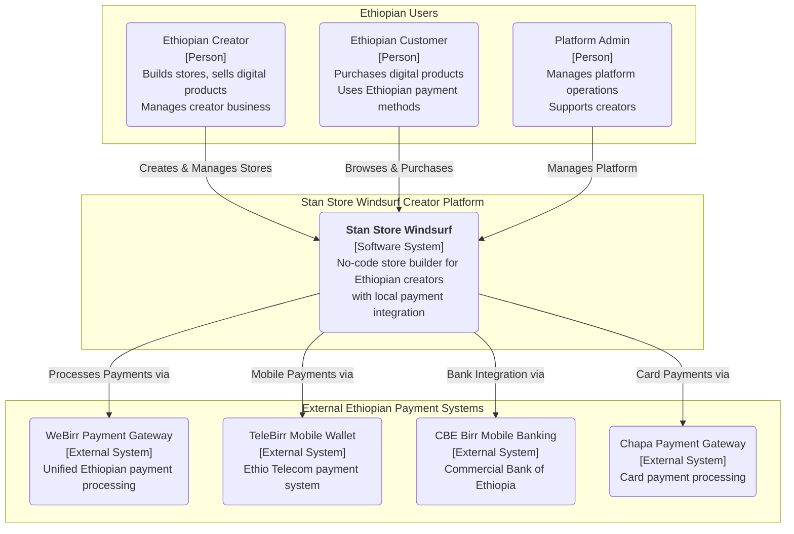

# Stan Store Windsurf - Architecture Governance & Living Diagrams

## 1. Overview

This document establishes the governance framework for all architectural diagrams within the Stan Store Windsurf ecosystem. Stan Store Windsurf is a no-code storefront builder optimized for Ethiopian creators, providing seamless integration with local payment systems and a focus on creator monetization.

The primary goal is to ensure that our architectural representations are accurate, up-to-date, and treated as living documentation ("docs-as-code"). All diagrams are version-controlled in Git alongside the source code they represent.

This approach replaces static, difficult-to-maintain diagrams (e.g., images, Visio files, ASCII art) with a standardized, code-based methodology.

## 2. Official Standard: Mermaid.js

**Mermaid.js is the single, mandatory standard for all new architectural diagrams.**

- **Why Mermaid?**:
  - **Version Controllable**: Plain text definitions can be managed in Git, allowing for history, diffing, and pull requests
  - **Integrated**: Renders directly in Markdown, keeping diagrams and explanatory text synchronized
  - **Accessible**: Text-based format is more accessible and easier to edit than binary formats
  - **Standardized**: Provides a consistent set of diagram types (C4, ERD, Sequence, etc.) for use across all teams

## 3. Diagram Management and Review Process

1. **Creation & Location**:
   - **High-Level Diagrams**: Key, system-wide diagrams like the System Context diagram below reside in this document as the canonical source
   - **Feature-Specific Diagrams**: Diagrams relevant to a specific feature, component, or service (e.g., store creation flow) should be embedded directly within the relevant Markdown document in the `docs` directory

2. **Review**: All new or modified diagrams must be submitted as part of a pull request and are subject to the same review process as source code. Reviewers must validate the diagram for accuracy, clarity, and adherence to the defined style

3. **Updates**: Diagrams are not "fire-and-forget." They must be updated as part of any change that alters the architecture they describe. Stale diagrams must be either updated or removed

## 4. Multi-Tenant Creator Platform Governance Principles

To ensure our creator-centric platform remains scalable, secure, and optimized for Ethiopian creators, all services must adhere to the following core governance principles:

- **Creator-Centric Design**: Every architectural decision prioritizes creator experience and monetization needs
- **Multi-Tenant Isolation**: Strong tenant isolation ensures creator data security and platform reliability
- **Ethiopian Payment Integration**: Native integration with WeBirr, TeleBirr, CBE Birr, and other local payment systems
- **Mobile-First Architecture**: Optimized for Ethiopian mobile networks and creator workflows
- **Community-Driven Growth**: Social features and referral systems built into platform architecture
- **No-Code Builder Performance**: Drag-and-drop functionality balanced with enterprise-grade reliability

## 5. Master System Context Diagram (C4 Model - Level 1)

This diagram represents the highest level of abstraction for the Stan Store Windsurf system, illustrating how it serves Ethiopian creators and customers.

## 6. Creator Platform Architecture Principles

### Core Design Principles:

#### 1. Creator-First User Experience
- **No-Code Builder**: Intuitive drag-and-drop store creation
- **Mobile-Optimized**: Native mobile apps for creator management
- **Ethiopian Cultural Adaptation**: Amharic support, local payment preferences
- **Community Integration**: Built-in creator networking and collaboration

#### 2. Ethiopian Payment Ecosystem Integration
- **Multiple Payment Methods**: WeBirr, TeleBirr, CBE Birr, card payments
- **ETB Currency**: Native Ethiopian Birr support throughout platform
- **Mobile Money Optimization**: Seamless integration with popular Ethiopian wallets
- **Payment Status Transparency**: Real-time payment tracking for creators

#### 3. Scalable Multi-Tenant Architecture
- **Tenant Isolation**: Each creator's store operates in isolated environment
- **Performance Optimization**: Efficient resource allocation per creator tier
- **Custom Domain Support**: Creator-branded store URLs
- **API Rate Limiting**: Fair usage across creator tiers

#### 4. Creator Growth and Monetization Focus
- **SEO Optimization**: Built-in SEO tools for creator discoverability
- **Social Media Integration**: Native sharing to Facebook, Telegram, Instagram
- **Analytics Dashboard**: Comprehensive creator performance metrics
- **Affiliate System**: Creator-to-creator product promotion capabilities

## 7. Other Key Diagram Types

While the C4 model is preferred for static structure, teams are encouraged to use other Mermaid diagram types as needed:

- **Sequence Diagrams**: For modeling store creation flows and checkout processes
- **Entity Relationship Diagrams (ERDs)**: For creator and product data models
- **Flowcharts**: For creator onboarding and payment processing workflows
- **User Journey Maps**: For Ethiopian creator and customer experience flows
- **Gantt Charts**: For feature development and creator platform enhancements

## 8. Creator Platform Data Architecture

### Key Data Domains:
- **Creator Profiles**: Business information, verification status, subscription tier
- **Store Configuration**: Themes, products, settings, customization data
- **Customer Management**: Purchase history, preferences, communication
- **Payment Processing**: Transaction records, settlement data, payment method storage
- **Analytics & Reporting**: Performance metrics, creator insights, platform usage

### Data Governance:
- **Creator Data Sovereignty**: Creators own their customer and sales data
- **ETH Compliance**: Adherence to Ethiopian data protection regulations
- **Payment Security**: PCI DSS compliance for payment processing
- **Audit Trails**: Comprehensive logging for creator and payment activities
